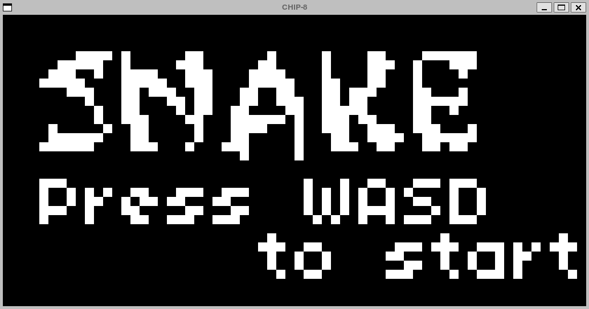

# chip8

An emulator I made for the CHIP-8 game console in C++.



## Requirements

SDL2 will need to be retrieved from your system's package manager.

#### Debian/Ubuntu

```bash
sudo apt install cmake libsdl2-dev
```

#### Arch

```bash
sudo pacman -S cmake sdl2
```

## Build & Run

Compile

```bash
mkdir build && cd build
cmake ..
make
```

Run

```bash
./chip8 [ROM]
```

There are a few games included in the `roms/` folder, there are tons more to be found online.

## Controls

|Key |Descrpition |
|:---:|:-----------------------|
|ESC |Quit the program |
|F1 |Reset emulation |
|SPACE|Toggle emulation speedup|

## Resources

- <https://multigesture.net/articles/how-to-write-an-emulator-chip-8-interpreter/>
- <http://devernay.free.fr/hacks/chip8/C8TECH10.HTM>
- <https://johnearnest.github.io/chip8Archive/>
